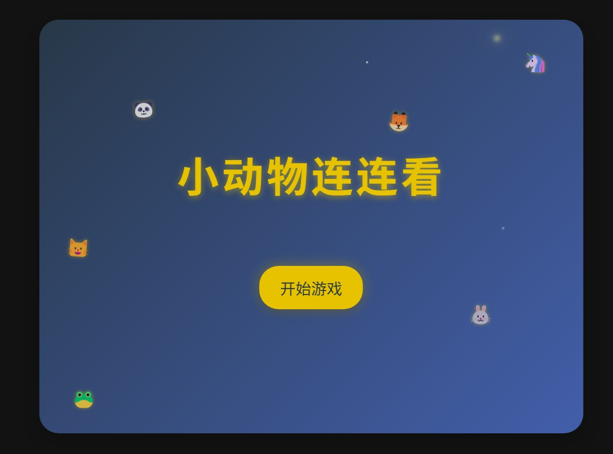
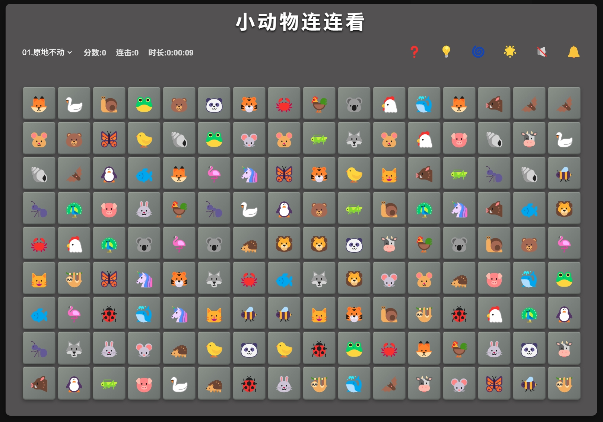
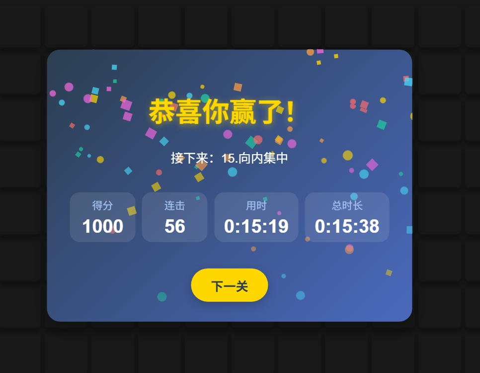

# 小动物连连看 AI 高清重制无敌版

**小动物连连看 AI 高清重制无敌版**，是由柒瑞精心设计与开发的一款公益开源、免费分享的休闲网页小游戏，旨在为大家提供轻松愉快的"摸鱼"时光，愿你在繁忙工作与学习之余，也能享受童年的美好回忆与简单的快乐！🎉🧸

## 获取方式

- **GitHub仓库**：[https://github.com/lukechern/llk](https://github.com/lukechern/llk)
- **NPM安装**：`npm i aillk`
- **Discuz!插件版**：[https://addon.dismall.com/plugins/llk.html](https://addon.dismall.com/plugins/llk.html)

---

## 🎮 游戏特色一：经典玩法、重温回忆、情怀再现  

🔗 延续传统连连看核心机制，点选连接、快速消除；熟悉的操作手感让你瞬间回到童年。无复杂规则，新手零门槛，上手超简单；老玩家也能轻松挑战高分，连击爽感、爆表成就感，重温那份久违的童趣与纯真。🎯

---

## 💪 游戏特色二：超级无敌、不限生命、无限提示、无限时间  

全新"无敌模式"来袭！告别传统闯关压力，无限生命助你无忧探索每一关；无限提示随时求助，不再卡关焦虑；无限时间让你放慢节奏，慢慢思考、轻松取胜。纵情畅玩，打造最无拘束的休闲体验！⌛✨

---

## 🌟 游戏特色三：矢量 SVG 图标、无损高清放大、互动特效、优美音乐、超炫音效  

所有动物图标均采用矢量 SVG 设计，支持任意比例无损放大，细节清晰锐利；消除时配合精美交互动画与炫酷光效，让每一次连线都焕发新鲜感；配合动听背景音乐与沉浸式音效，带来视觉与听觉的双重享受。🎶🔊

---

## 🎨 游戏特色四：长宽难度、方块图片、方块色系、可自定义  

自由度超高：支持玩家灵活调整棋盘行列与关卡难度，从轻松休闲到烧脑挑战，多种级别自由切换；同时可后台自定义方块内的图案风格与主题色系，创造独一无二的专属连连看。🔧🎨

---

## 📱💻 游戏特色五：电脑手机、即开即玩、无需下载、无需安装  

完美适配 Windows、Mac、Android、iOS 等多端设备，只需一键打开网页，即可极速加载，无需任何插件或安装包。随时随地，想玩就玩，真正做到轻量便捷，省时省力。🌐⚡

---

## 💡 温馨提示：为爱发电，公益分享，没有服务  

本游戏秉承"为爱发电"的公益理念，完全免费开源分享，不提供商业服务与技术支持。如在使用过程中遇到问题，欢迎在社区互助交流，但请理解作者团队无偿维护，感谢大家的理解与支持！🙏

---

## ❤️ 特别感谢：  

❤️ 衷心感谢以下 AI 与技术团队提供的重要技术支援（排名不分先后）：

- Claude-3.7-sonnet  
- Gemini-2.5-pro  
- GPT-4o  
- DeepSeek-v3  
- Cursor  
- Trae  
- 通义灵码  

你们的智慧之光，让这个小小的链接世界充满无限可能，也让这款游戏更加精彩纷呈！🚀

❤️ 本游戏软件素材使用了twEmoji库、openEmoji库以及一些网络搜集的免费音乐、音效，特别感谢；

   ## 游戏截图
   
  -  欢迎进入游戏卡片 welcome card 
   
   
   
  - 电脑版截图 PC screenshot
   
   
   
  - 手机版截图 mobile screenshot
       
   
   
   
  - 过关成绩结算卡片success card
   
   
   
  - 参数设置页面（这一部分仅限discuz插件版本 https://addon.dismall.com/?@llk.plugin ，当然如果不用discuz插件版，你也可以在userConfig\userConfig.js中设定参数）Settings Page (This section is only applicable to the Discuz plugin version: https://addon.dismall.com/?@llk.plugin. Of course, if you're not using the Discuz plugin version, you can also configure the parameters in `userConfig/userConfig.js`.) 
   
   

## English Description

# Animal Link-Link AI HD Remastered Invincible Edition

**Animal Link-Link AI HD Remastered Invincible Edition** is a casual browser game carefully designed and developed by Qirui. It's a public welfare, open-source, and free-to-share project aimed at providing everyone with a relaxing "slacking off" moment. May you enjoy the sweet memories of childhood and the simple joys of life amidst your busy work or study! 🎉🧸

## How to Get

- **GitHub Repository**: [https://github.com/lukechern/llk](https://github.com/lukechern/llk)
- **NPM Installation**: `npm i aillk`
- **Discuz! Plugin Version**: [https://addon.dismall.com/plugins/llk.html](https://addon.dismall.com/plugins/llk.html)

---

## 🎮 Game Feature 1: Classic Gameplay, Nostalgic Vibes, Emotional Throwback

🔗 Faithfully recreates the core mechanics of traditional Link-Link games — tap to connect, match and eliminate fast! The familiar feel brings you right back to childhood. No complicated rules, zero learning curve for beginners, and veterans can still go for high combos and epic scores. Relive the long-lost innocence and pure fun. 🎯

---

## 💪 Game Feature 2: Invincible Mode, Unlimited Lives, Unlimited Hints, Unlimited Time

Introducing the brand new **Invincible Mode**! Say goodbye to traditional level stress — unlimited lives let you explore every stage without worry; unlimited hints mean you're never stuck; unlimited time gives you the freedom to slow down, think, and win at your own pace. Play freely and enjoy the most relaxing experience ever! ⌛✨

---

## 🌟 Game Feature 3: Vector SVG Icons, Lossless HD Scaling, Interactive Effects, Lovely Music, Epic Sound FX

All animal icons are designed in vector SVG format, allowing for sharp, lossless scaling at any size. Matching tiles triggers beautiful animations and dazzling light effects, making every connection feel fresh and exciting. Paired with pleasant background music and immersive sound effects, you get a delightful audiovisual experience. 🎶🔊

---

## 🎨 Game Feature 4: Adjustable Grid Size, Tile Images, Tile Color Themes – Fully Customizable

Ultra-high freedom: players can freely adjust the grid dimensions and difficulty levels, from casual play to brain-teasing challenges. The tile images and theme color schemes are customizable in the backend, allowing you to create a one-of-a-kind, personalized Link-Link game. 🔧🎨

---

## 📱💻 Game Feature 5: Desktop & Mobile Compatible, Instant Play, No Download, No Installation

Fully compatible with Windows, Mac, Android, iOS, and more. Just open the webpage with one click and play instantly — no plugins, no installations needed. Truly lightweight and convenient, ready to play anytime, anywhere! 🌐⚡

---

## 💡 Friendly Reminder: Powered by Love, Shared for Good, No Commercial Service

This game is built with love and shared as a public welfare project. It is completely free and open source, and offers no commercial services or technical support. If you encounter issues, feel free to discuss and help each other in the community — please understand that the developer team maintains this voluntarily. Thank you for your understanding and support! 🙏

---

## ❤️ Special Thanks:

Sincere thanks to the following AI and tech teams for their valuable support (in no particular order):

- Claude-3.7-sonnet  
- Gemini-2.5-pro  
- GPT-4o  
- DeepSeek-v3  
- Cursor  
- Trae  
- Tongyi Lingma (通义灵码)

Your brilliance brings infinite possibilities to this little world of connections, making the game even more exciting and vibrant! 🚀

This game uses assets from the **twEmoji**, **openEmoji** libraries and some free music and sound effects collected from the Internet — with special thanks!

